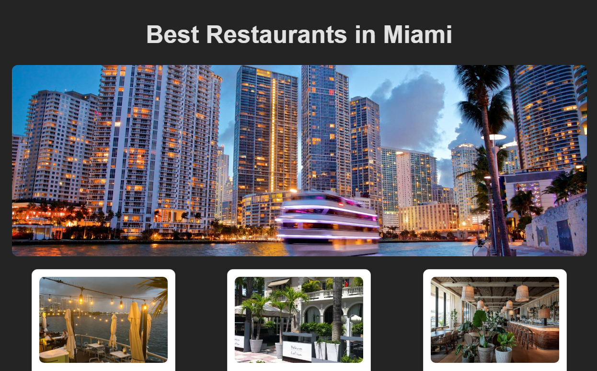

# Web Development Project 1 - *Best Restaurants in Miami*

Submitted by: **Stephanie B**

**Best Restaurants in Miami is a React/Vite based community board project that showcases popular dining locations in Miami. The application uses reusable components and props to display restaurant information in a clean, responsive card layout. Users can browse through restaurant options, view images and descriptions, and visit restaurant websites through external links. The project was built using React with Vite, JavaScript, and CSS Grid.**

Time spent: **2** hours spent in total

## Required Features

The following **required** functionality is completed:

- [x] **The app has a cohesive, unique theme for events or resources relevant to a specific community**
  - [x] Header/title describing the theme is displayed
- [x] **At least 10 unique events or resources are displayed in a responsive card format**
  - [x] There are at least 10 cards displayed 
  - [x] The cards should be displayed in an organized format (ex. a grid, or in one line)
  - [x] Each card should include some information about the event or resource

The following **optional** features are implemented:

- [x] Buttons or links to a related resources are on each card component
  - [x] All cards have buttons or links in addition to text
- [x] The site is responsive for both desktop and mobile formats
  - [x] Web app is shown in a mobile format
  - [x] **Video Walkthrough Special Instructions**: To ease the grading process, please use Chrome Developer Tools' "Toggle Device" button to demonstrate that your web application's responsiveness in both a desktop *and* a mobile format. Detailed instructions can be found below this stretch feature on the project page. 

The following **additional** features are implemented:

* [ ] List anything else that you added to improve the site's functionality!

## Video Walkthrough

Here's a walkthrough of implemented required features:

<a href = 'https://i.imgur.com/wI1niGl.gif'>Video Walkthrough<a/>

<!-- Replace this with whatever GIF tool you used! -->
GIF created with ... 
[ScreenToGif](https://www.screentogif.com/)

## Notes

Describe any challenges encountered while building the app.

Some challenges I encountered while building the app included learning how to properly pass and use props between components, organizing data using arrays and mapping through it to generate cards, and adjusting CSS layouts to center and display the cards in a responsive grid format. Additionally, styling the board to look clean while keeping the code simple required some experimentation.

## License

    Copyright [yyyy] [name of copyright owner]

    Licensed under the Apache License, Version 2.0 (the "License");
    you may not use this file except in compliance with the License.
    You may obtain a copy of the License at

        http://www.apache.org/licenses/LICENSE-2.0

    Unless required by applicable law or agreed to in writing, software
    distributed under the License is distributed on an "AS IS" BASIS,
    WITHOUT WARRANTIES OR CONDITIONS OF ANY KIND, either express or implied.
    See the License for the specific language governing permissions and
    limitations under the License.
